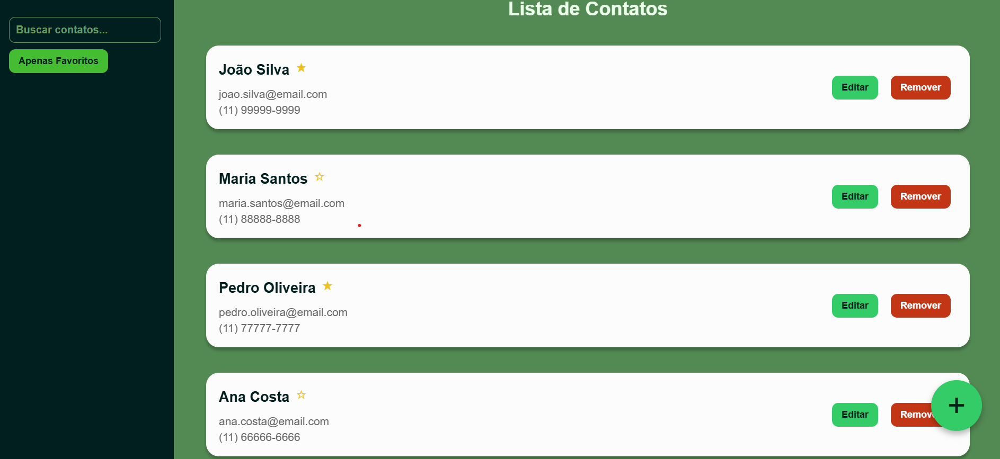

# 📞 Contact List - Gerenciador de Contatos

Uma aplicação moderna de gerenciamento de contatos desenvolvida com React, TypeScript e Redux Toolkit. Interface intuitiva para adicionar, editar, remover e favoritar contatos com sistema de filtros e busca.

## 📸 Screenshot


*Interface do Contact List com lista de contatos e funcionalidades de gerenciamento*

## 🚀 Funcionalidades

- **Lista de Contatos** - Visualização organizada de todos os contatos
- **Adicionar Contatos** - Formulário para cadastro de novos contatos
- **Editar Contatos** - Modificação de informações existentes
- **Remover Contatos** - Exclusão de contatos da lista
- **Sistema de Favoritos** - Marcar contatos como favoritos
- **Filtros e Busca** - Localizar contatos rapidamente
- **Validação de Dados** - Prevenção de contatos duplicados
- **Design Responsivo** - Interface adaptável para diferentes dispositivos
- **Estado Global** - Gerenciamento de estado com Redux Toolkit
- **Roteamento** - Navegação entre páginas com React Router

## 🛠️ Tecnologias Utilizadas

- **React 19.1.0** - Biblioteca para construção da interface
- **TypeScript 5.8.3** - Superset do JavaScript com tipagem estática
- **Redux Toolkit 2.8.2** - Gerenciamento de estado global
- **React Redux 9.2.0** - Integração React com Redux
- **React Router 7.6.3** - Roteamento e navegação
- **Styled Components 6.1.18** - CSS-in-JS para estilização
- **Vite 7.0.0** - Build tool e servidor de desenvolvimento
- **ESLint + Prettier** - Linting e formatação de código

## 📋 Pré-requisitos

- Node.js (versão 16 ou superior)
- npm ou yarn

## 🚀 Como Executar

1. **Clone o repositório**
   ```bash
   git clone <url-do-repositorio>
   cd contactList
   ```

2. **Instale as dependências**
   ```bash
   npm install
   ```

3. **Execute o projeto em modo de desenvolvimento**
   ```bash
   npm run dev
   ```

4. **Acesse a aplicação**
   - Abra seu navegador e acesse `http://localhost:5173`

## 📦 Scripts Disponíveis

- `npm run dev` - Inicia o servidor de desenvolvimento
- `npm run build` - Gera build de produção
- `npm run preview` - Visualiza o build de produção
- `npm run lint` - Executa o linter ESLint com correção automática

## 🏗️ Estrutura do Projeto

```
src/
├── components/
│   ├── AddButton/         # Botão para adicionar contatos
│   └── Contact/           # Componente individual de contato
├── containers/
│   ├── AsideBar/          # Barra lateral com filtros
│   ├── ContactList/       # Lista principal de contatos
│   └── Form/              # Formulário de cadastro/edição
├── pages/
│   ├── Home/              # Página principal
│   └── Register/          # Página de cadastro
├── store/
│   └── reducers/          # Reducers do Redux (contacts, filter)
├── models/
│   └── Contact.ts         # Modelo de dados do contato
├── theme/
│   └── theme.ts           # Configuração de temas
└── styles/
    └── index.ts           # Estilos globais
```

## 🎯 Como Usar

1. **Visualize Contatos**: A página principal exibe todos os contatos cadastrados
2. **Adicione Contatos**: Clique no botão "+" para cadastrar novos contatos
3. **Edite Contatos**: Clique em um contato para modificar suas informações
4. **Marque Favoritos**: Use o sistema de favoritos para destacar contatos importantes
5. **Filtre Contatos**: Use a barra lateral para filtrar e buscar contatos
6. **Remova Contatos**: Exclua contatos que não são mais necessários

## 📞 Funcionalidades do Gerenciador

### 👥 **Gerenciamento de Contatos**
- Cadastro com validação de dados
- Edição de informações existentes
- Exclusão de contatos
- Prevenção de duplicatas por nome

### ⭐ **Sistema de Favoritos**
- Marcar contatos como favoritos
- Visualização destacada de favoritos
- Toggle rápido de status

### 🔍 **Filtros e Busca**
- Filtro por favoritos
- Busca por nome, email ou telefone
- Interface intuitiva na barra lateral

### 📱 **Interface Responsiva**
- Design adaptável para mobile e desktop
- Componentes otimizados para diferentes telas
- UX intuitiva e moderna

## 🔧 Arquitetura

### **Estado Global (Redux)**
- **Contacts**: Gerencia lista de contatos
- **Filter**: Controla filtros e busca
- **Persistência**: Estado mantido durante navegação

### **Componentes**
- **ContactList**: Lista principal de contatos
- **Form**: Formulário de cadastro/edição
- **AsideBar**: Filtros e controles
- **Contact**: Card individual de contato

## 🎨 Características do Design

- **Styled Components**: CSS-in-JS para estilização modular
- **Design System**: Componentes reutilizáveis
- **Responsividade**: Adaptação automática para diferentes dispositivos
- **Tema Consistente**: Paleta de cores e tipografia unificadas
- **UX Otimizada**: Interface intuitiva e fácil de usar

## 📝 Licença

Este projeto está sob a licença MIT. Veja o arquivo [LICENSE](LICENSE) para mais detalhes.

## 👨‍💻 Desenvolvido por

Phillip Menezes - contato.phillip.menezes@gmail.com

---

**Nota**: Este é um projeto de demonstração de gerenciamento de contatos desenvolvido com as melhores práticas de React e TypeScript.
